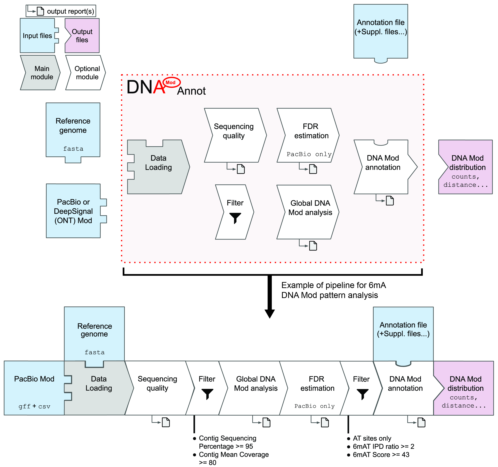

# DNAModAnnot: DNA Modification filtering and Annotation using long-read sequencing data

## Introduction
DNAModAnnot is a R package providing a comprehensive toolkit for the genome-wide analysis and annotation of DNA modifications (Mod) (e.g. 6-methyladenine (6mA) or 5-methylcytosine (5mC)). Its modular architecture allows the analysis of Mod detection performed using Pacific Biosciences (PacBio) kineticsTools or Oxford Nanopore Technologies via DeepSignal software. DNAModAnnot also provides customized visualization functions to describe DNA modification patterns.

## Description  
  

Functions from the following modules can be combined according to the upper diagram.
1.	“Data loading” module – Functions such as `ImportPacBioCSV` or `ImportDeepSignalModFrequency` can be used to import input files and convert them as GRanges-like objects.
2.	“Sequencing quality” module – Functions in this module will check reference genome provided and compute (and visualize), per contig, the mean of provided parameters (coverage, methylation fraction etc...).
3.	“Global DNA Mod analysis” module – Functions like `GetModReportPacBio` or `DrawModLogo` will allow a global view of DNA Mod and its parameters at the genome-wide level or per contig.
4.	“FDR estimation” module – For PacBio data only: False Discovery Rate will be estimated using a control dataset (non-methylated DNA, e.g. PCR-amplified DNA) or using DNA Mod enriched motifs. This will help choosing filters (on ipdRatio, score or even identificationQv parameters) adapted to the quality of the data and the intensity of the Mod signal in the genome.
5.	“Filter” module – `FiltPacBio` and `FiltDeepSignal` can be used to filter respectively PacBio and DeepSignal data within R. Data can be filtered based on the contigs or FDR-associated filtering thresholds.
6.	“DNA Mod annotation” module – The last module contains functions allowing comparisons with genome annotation provided. Matching sequencing data (imported via rtracklayer package for example) can be easily compared with DNA Mod distribution and genome annotation using this module.

## Required input
As input, DNAModAnnot will need:
-	either PacBio data pre-processed with PacBio's kineticsTools software (https://github.com/PacificBiosciences/kineticsTools): the output of the ipdSummary script will then be required (the modifications.csv and modifications.gff files).
-	or ONT data pre-processed with the DeepSignal software (https://github.com/bioinfomaticsCSU/deepsignal): the output of the call_modification_frequency.py script will then be required.

Some functions from the DNAModAnnot package will require additional input:
-	the reference genome used for alignment in fasta format will be required for a majority of DNAModAnnot’s functions.
-	the reference genome annotation must be imported and converted as a GRanges object for comparison with genomic features. This can be easily achieved using import functions from the rtracklayer package.

Additional files, such as other sequencing files, can be imported and compared with DNA modifications distribution: these files must be converted as GRanges objects after importation. This can be achieved using the Rsamtools package or the rtracklayer package: then GRanges-like objects (such as GPos, GAlignments...) must be converted as GRanges.

## Dependencies

R (>= 4.0.0)

Packages:  
Biostrings (>= 2.10.0), GenomicRanges (>= 1.38.0), BSgenome (>= 1.28.0), Biobase (> 2.1.0),  
BiocGenerics (>= 0.34.0), GenomeInfoDb (>= 1.14.0), Gviz (>= 1.29.1), IRanges (>= 2.20.0),   
Logolas (>= 1.3.1), S4Vectors (>= 0.24.0), data.table (>= 1.13.0), rtracklayer (>= 1.30.0),   
Rsamtools (>= 2.0.0)

## Installation

First, install required packages using BiocManager:
```
if (!requireNamespace("BiocManager", quietly = TRUE))
    install.packages("BiocManager")

BiocManager::install(c('Biostrings', 'BSgenome', 'Gviz'))
```

Logolas package is depreciated in the latest version of Bioconductor and must be installed with a source file.
(This dependency will be replaced in future versions of the DNAModAnnot package.)
Logolas source file can be obtained from previous versions of Bioconductor:
```
#Logolas package
url="https://www.bioconductor.org/packages/3.11/bioc/src/contrib/Logolas_1.11.0.tar.gz"
download.file(url, destfile = "Logolas_1.11.0.tar.gz")

BiocManager::install(c('SQUAREM', 'LaplacesDemon', 'gridBase'))
install.packages("Logolas_1.11.0.tar.gz", repos = NULL, type = 'source')
```
Then you can directly install from GitHub using devtools package:
```
install.packages("devtools")
library(devtools)
install_github("AlexisHardy/DNAModAnnot")
```

You should then be able to load the package into your R session with:
`library(DNAModAnnot)`


### Alternative installation
You can install DNAModAnnot using the tar.gz file from GitHub repository:
```
setwd("path/to/package/file/")
install.packages("DNAModAnnot_0.0.0.9015.tar.gz", repos = NULL, type = 'source')
```

## Usage
For detailed instructions, check the package vignette (in 'doc' directory).

## Citation
...
